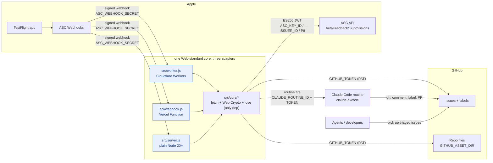

# asc-gh-feedback

TestFlight feedback → GitHub issues → Claude routine triage. One Web-standard core, deployable to Cloudflare Workers, Vercel, or any Node 20+ host.

## How it works

```mermaid
sequenceDiagram
    autonumber
    actor Tester as TestFlight tester
    participant Apple as App Store Connect
    participant Svc as asc-gh-feedback<br/>(/webhook)
    participant ASC as ASC API
    participant GH as GitHub
    participant CC as Claude Code routine

    Tester->>Apple: Submit screenshot feedback / crash
    Apple->>Svc: POST /webhook (HMAC-SHA256 signed)
    Svc->>Svc: Verify X-Apple-Signature<br/>(constant-time, 401 on mismatch)
    Svc-->>Apple: 200 received
    Svc->>GH: Search "asc-feedback-id" (dedupe)
    Svc->>ASC: GET submission (ES256 JWT)<br/>?include=build,tester
    ASC-->>Svc: Comment, device/OS/build, screenshot URLs, crash log
    Svc->>ASC: Download screenshots / crash log
    Svc->>GH: Commit screenshots to GITHUB_ASSET_DIR
    Svc->>GH: Create issue (labels: testflight-feedback,<br/>needs-triage, crash)
    Svc->>CC: POST /v1/claude_code/routines/{id}/fire<br/>(issue URL + summary; optional, best-effort)
    CC->>GH: Analyze code, comment root cause,<br/>relabel triaged, open PR if confident
```



Handles `betaFeedbackScreenshotSubmissionCreated` and `betaFeedbackCrashSubmissionCreated`:
verifies the HMAC-SHA256 signature, fetches full submission details from the ASC API,
downloads screenshots and commits them to the repo, opens a labeled issue
(`testflight-feedback`, `needs-triage`, `crash` for crashes), then fires the Claude
routine with the issue URL. Idempotent per submission (searches existing issues for
`asc-feedback-id`).

## Layout

```
src/core/       runtime-agnostic logic (fetch + Web Crypto only)
src/worker.js   Cloudflare Workers entry (uses ctx.waitUntil)
api/webhook.js  Vercel Function entry (+ vercel.json rewrites /webhook → /api/webhook)
src/server.js   plain Node adapter (npm start)
```

## Dependencies

- **Runtime:** [`jose`](https://github.com/panva/jose) only — ES256 JWT signing for the ASC API, Web Crypto-based so it runs on Workers/Vercel/Node identically. Everything else is platform built-ins (`fetch`, `crypto.subtle`).
- **External services:** App Store Connect (webhooks + API), GitHub REST API, and optionally the Claude Code routines fire endpoint (`api.anthropic.com/v1/claude_code/.../fire`, beta header `experimental-cc-routine-2026-04-01`).
- **Dev/deploy only:** `vercel` CLI (local dep) or `wrangler` (via npx) — not shipped in the function bundle.

## Env vars

| Var | Notes |
| --- | --- |
| `ASC_WEBHOOK_SECRET` | secret you set on the ASC webhook (`openssl rand -hex 32`) |
| `ASC_KEY_ID` / `ASC_ISSUER_ID` | ASC API team key (App Manager role) |
| `ASC_PRIVATE_KEY` or `ASC_PRIVATE_KEY_B64` | .p8 contents (\n-escaped) or `base64 < AuthKey.p8` |
| `GITHUB_TOKEN` | fine-grained PAT, Issues:write + Contents:write on the repo |
| `GITHUB_REPO` | target repo, `owner/repo` (required) |
| `GITHUB_ASSET_DIR` / `GITHUB_LABELS` | optional |
| `CLAUDE_ROUTINE_ID` / `CLAUDE_ROUTINE_TOKEN` | routine API trigger (claude.ai/code/routines) |

## Deploy

### Cloudflare Workers (recommended — waitUntil keeps webhook ACK instant)

```bash
npm install
npx wrangler login
npx wrangler secret put ASC_WEBHOOK_SECRET
npx wrangler secret put ASC_KEY_ID
npx wrangler secret put ASC_ISSUER_ID
npx wrangler secret put ASC_PRIVATE_KEY_B64
npx wrangler secret put GITHUB_TOKEN
npx wrangler secret put CLAUDE_ROUTINE_TOKEN
npx wrangler deploy
```

Webhook URL: `https://asc-gh-feedback.<your-subdomain>.workers.dev/webhook`. Non-secret vars live in [wrangler.toml](wrangler.toml).

### Vercel

```bash
npm install
npx vercel link
npx vercel env add ASC_WEBHOOK_SECRET   # repeat for the vars above
npx vercel deploy --prod
```

Webhook URL: `https://<project>.vercel.app/webhook` (rewritten to the function; processing is awaited within the request, `maxDuration: 60`).

### Plain Node (Railway / Fly / Render / VPS)

```bash
npm install && npm start   # POST /webhook on :8484
```

Local testing without a deploy: `cloudflared tunnel --url http://localhost:8484` (or `npx wrangler dev` for the Worker).

## Create the ASC webhook

App Store Connect → your app → Webhooks (or via API), URL `https://YOUR_HOST/webhook`, your secret, subscribed to the two TestFlight feedback event types:

```bash
curl -X POST "https://api.appstoreconnect.apple.com/v1/webhooks" \
  -H "Authorization: Bearer $ASC_JWT" -H "Content-Type: application/json" \
  -d '{
    "data": {
      "type": "webhooks",
      "attributes": {
        "name": "testflight-feedback",
        "url": "https://YOUR_HOST/webhook",
        "secret": "YOUR_SECRET",
        "enabled": true,
        "eventTypes": [
          "BETA_FEEDBACK_SCREENSHOT_SUBMISSION_CREATED",
          "BETA_FEEDBACK_CRASH_SUBMISSION_CREATED"
        ]
      },
      "relationships": {
        "app": { "data": { "type": "apps", "id": "YOUR_APP_ID" } }
      }
    }
  }'
```

(If the API rejects the event type identifiers, check `GET /v1/webhookEventTypes` or tick the boxes in the UI.)

## Claude routine

Optional. Create a routine at claude.ai/code/routines with a triage prompt for your repo (read the issue + screenshots, analyze the code, label, comment, open PRs for confident fixes), then Add another trigger → API → Generate token. Set `CLAUDE_ROUTINE_ID` (the `trig_...` id) and `CLAUDE_ROUTINE_TOKEN`. Leave both unset to just get labeled issues without automated triage.

To have an agent gather all requirements interactively (browser/computer use with you present), use the prompt in [agents/collect-requirements.md](agents/collect-requirements.md).

## Test

```bash
npm run simulate                      # fake signed event against http://localhost:8484
WEBHOOK_URL=https://YOUR_HOST/webhook npm run simulate -- betaFeedbackScreenshotSubmissionCreated REAL_SUBMISSION_ID
```

Real submission ids: `GET /v1/apps/{id}/betaFeedbackScreenshotSubmissions`.

## Notes
- Screenshots are committed to `GITHUB_ASSET_DIR` on the default branch; on a private repo inline previews render only for repo members.
- Routine fire is best-effort: if it fails the issue still exists with `needs-triage` for a later sweep.
- Crash log text truncated to 60k chars in a `<details>` block.
