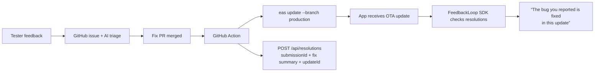

# Full-circle feedback loop (design)

Goal: close the loop end to end — tester reports → issue → fix → **ship the fix OTA → tell the person who reported it**. Today the pipeline ends at "fix PR merged"; this doc designs the rest, with Expo/EAS as the first-class path.



## The honest constraint

TestFlight's native feedback is one-way: Apple gives us the tester's **email** and device metadata, but no reply channel and no in-app identity. So there are two tiers:

### Tier 1 — works with native TestFlight feedback (no SDK)

1. **Resolution record.** When an issue with an `asc-feedback-id` marker is closed by a merged PR, a GitHub Action calls `POST /api/resolutions` with the submission id, fix summary, PR link, and (for Expo apps) the EAS update id. We store it next to the tenant record.
2. **EAS trigger.** The same Action runs `eas update --branch production --message "fix: <issue title>"` when the repo is an Expo app (`EAS_PROJECT_ID` configured on the tenant). Result: reporters get the fix minutes after merge, no App Store review.
3. **Notify via TestFlight build notes / email digest.** Without an SDK the "notify the reviewer" step is limited to: (a) appending "Fixed: <their feedback quote>" to the next build's What to Test via the ASC API (`betaBuildLocalizations`), which every tester sees, and (b) an optional email to the tester address Apple provided (requires the operator to enable it and an email provider key — off by default for privacy).

### Tier 2 — full circle with the FeedbackLoop SDK (Expo first)

A tiny `@feedbackloop/expo` module the app embeds:

- **Capture**: an in-app "Report a bug" sheet (shake or screenshot share) that POSTs to `/t/{tenant}/app-feedback` with a locally generated `reporterId` (random UUID stored on device — no PII). Same pipeline: issue, triage, destinations. Because *we* captured it, the loop is closable per-person.
- **Close the loop**: on each app start (and after each `Updates.checkForUpdateAsync()`), the SDK calls `GET /t/{tenant}/resolutions?reporterId=…`. If any of that reporter's submissions are resolved and the running update ≥ the fix's `updateId`, it shows a one-time card: *"Your report — 'capacity shows 200%' — was fixed in this update. Thanks for the catch. 🎉"*
- Server keeps `submissionId → reporterId` only for SDK-originated feedback; native TestFlight feedback stays Tier 1.

## Implementation order

1. `POST /api/resolutions` + storage + `GET /t/{id}/resolutions` (small, no SDK needed) and a reusable GitHub Action (`feedbackloop/notify-action`): on issue close → resolution record; if `EAS_PROJECT_ID` → `eas update`; append build notes via ASC API.
2. Dashboard: per-tenant EAS settings (project id, branch) + resolutions log.
3. Expo SDK package (capture sheet + resolution toast), dogfooded on our own apps.
4. Email notify (opt-in, BYO Resend/Postmark key).

## Tenant record additions

```json
{
  "eas": { "projectId": "…", "branch": "production" },
  "resolutions": [{ "submissionId": "…", "issue": 2384, "pr": 2386, "summary": "…", "updateId": "…", "resolvedAt": "…", "notified": false }]
}
```
