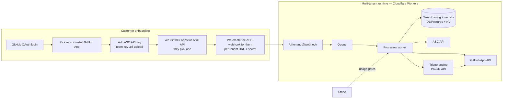

# Converting asc-gh-feedback into a paid multi-tenant service

Design sketch for a hosted product: a customer signs in with GitHub and connects App Store Connect; we manage the webhook, feedback flow, and triage for them.

## What changes conceptually

Today: one deployment = one app = one repo, secrets in env vars, config baked at deploy time.
Product: one deployment serves N customers; per-tenant config and secrets live in a database; webhook URLs are per-tenant; billing gates usage.

## Key design decisions

### 1. Auth & identity
- **GitHub OAuth** for login/account identity; **GitHub App** (not PATs) for repo access — customers install it on the one repo, we get scoped `issues:write`/`contents:write` installation tokens that rotate automatically and revoke cleanly. This is the single biggest trust upgrade over the self-hosted version.
- **App Store Connect has no OAuth** — there is no "log in with Apple to grant ASC access". The honest flow is: customer creates a **team API key** (App Manager) in their ASC and uploads the `.p8` + Key ID + Issuer ID to us, or better, creates an **individual key scoped to one app** where available. Store encrypted (KMS envelope encryption); display only the key id after saving. This is the same trust model Fastlane/CI vendors (Bitrise, Codemagic, RevenueCat) use — customers already accept it.

### 2. Per-tenant webhooks
- Webhook URL: `https://api.example.com/t/{tenantId}/webhook`, per-tenant random secret. We create the ASC webhook **for** the customer via their key (`POST /v1/webhooks`) during onboarding — zero manual steps.
- Verify HMAC per tenant, enqueue, ACK instantly. A queue (Cloudflare Queues / SQS) decouples Apple's 3s-ish expectations from ASC fetches + image transfers and gives retries with backoff + a dead-letter list surfaced in the dashboard.

### 3. Storage
- Tenant row: github installation id, repo, asc key ref, app id, webhook id + secret ref, label config, triage settings, plan.
- Screenshots: don't commit to the customer repo by default (pollutes history). Store in R2/S3 behind signed URLs and embed those in issues; "commit to repo" stays as an opt-in for customers who want everything in git.
- Idempotency: submission id unique-keyed in DB, not via GitHub search (cheaper, race-free).

### 4. Triage engine
- Replace per-customer Claude routines with a first-party triage worker calling the **Claude API** (our key, our cost model): fetch issue + screenshots + crash log, run the same claim-first analyze→comment→label playbook via the GitHub App. Usage-metered per triage.
- Tiering: Free = issues only, no AI. Pro = AI triage comments + labels. Team = triage + fix-PR generation (Claude Code SDK sessions against a shallow clone, or GitHub-hosted runner), Slack/Linear/Jira sinks.
- Customers who prefer their own Claude Code routines can still paste a fire URL + token (bring-your-own-routine escape hatch = today's model).

### 5. Billing
- Stripe: subscription (plan) + metered usage (feedback events processed, AI triages, PR fixes). Webhook events are cheap; AI is the margin driver. Rate-limit free tier per app/day.

### 6. Ops & trust
- Per-tenant delivery log (mirror of ASC's `deliveries` + our processing outcome) in the dashboard — the #1 support question will be "where did my feedback go".
- Secrets: KMS-encrypted at rest, never logged; ASC key health check (JWT smoke test) on save and nightly; alert on 401s (revoked key) instead of silently dropping.
- Data deletion: offboarding deletes the ASC webhook via their key, revokes nothing they own, purges stored screenshots.

## Migration path from this repo

1. Extract `src/core/{verify,asc,github}.js` unchanged — they already take config per call; swap `makeConfig(env)` for `loadTenant(tenantId)`.
2. Add `/t/:tenantId/webhook` routing + queue producer in the worker adapter.
3. Onboarding web app (Next.js on the same domain): GitHub OAuth + App install, ASC key upload wizard (reuses the app-list JWT check from the deploy skill), webhook auto-create.
4. Triage worker: port the routine prompt (claim-first, analyze, label, PR) to a Claude API/Agent SDK loop with GitHub App auth.
5. Stripe + dashboard last — first ten customers can be hand-configured rows.

Realistic MVP cut: GitHub App + ASC key upload + auto webhook + issues with stored screenshots + AI triage comment, one plan, manual Stripe links. Everything else is iteration.
